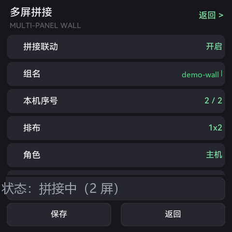
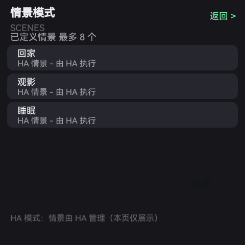
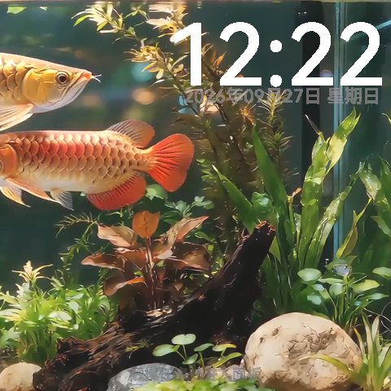
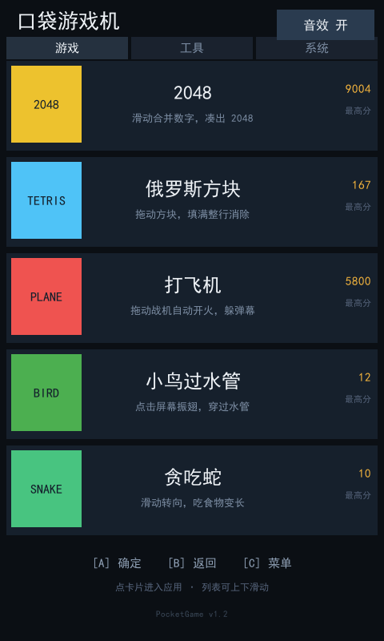
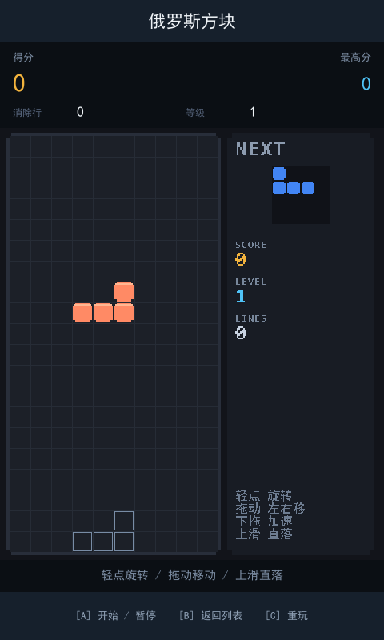
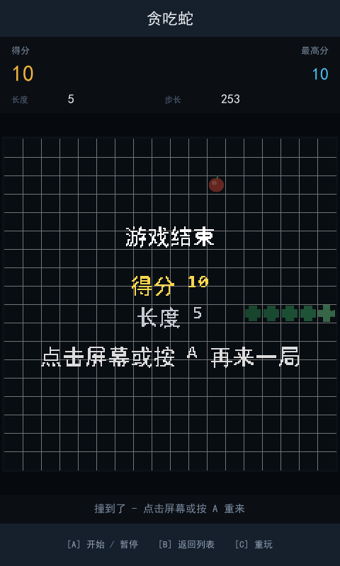

<div align="center">

# 🦅 FlyThings MCP

**让 AI 助手直接获得 FlyThings OS 的开发能力：克隆到本地 → 把路径交给你的 AI → 用中文说需求就行**

flythings-mcp | FlyThings MCP | FlyThings OS | FlyThings AI 助手 | 中科世为 MCP | FlyThings HMI

[](LICENSE)
[](https://www.python.org/downloads/)
[](https://modelcontextprotocol.io/)

</div>

---

## 这是什么

一个**本地离线**的 MCP 服务：装上它，你的 AI 助手（Trae / Cursor / Kimi / Claude Desktop 等）就能直接
**建 FlyThings 工程、做界面、编译部署到真机、抓屏验收、出升级包**——不需要联网、不需要 API Key。
知识库（控件字段、坑位、硬件型号）全部随包，AI 会话里就能检索到。

## 安装（3 步，全程只用同一个本地目录）

> ⚠️ **只 clone 一份、只装一份**：本 MCP 必须用**仓库路径**运行（**不要** `pip install` 到全局，也**不要**把目录复制到别处）。
> 否则机器上会出现多份 Python / 多份 MCP，配置互相打架、版本对不上——这是最常见的踩坑。需要 Python 3.10+。

**第 1 步：clone 到本地任意目录**

```bash
git clone https://gitee.com/Kwolve/flythingsmcp_release.git
```

**第 2 步：把这个本地目录的路径交给你的 AI，让它装**

```
我本地克隆了 FlyThings MCP，路径是 <你的本地路径>/flythingsmcp_release
请用这个目录里的 requirements.lock 安装依赖，并帮我把 MCP 配置好（stdio）。
```

AI 会：按 `requirements.lock` 装依赖（已锁定、实测通过的组合）→ 生成配置 → 跑一次离线自检。
装完确认目录里有 `mcp_server.py`、`toolchain/`（`fun.exe` + `fui.exe`）、`knowledge/`、`models/`。

**第 3 步：配置到 AI 工具（stdio）**—— 在**你的项目根目录**建 `.mcp.json`（Trae / Cursor / Kimi 均识别），
`args` 填**你本机这份仓库的绝对路径**（就是你 clone 下来的那个目录，别写别处的路径）：

```json
{
  "mcpServers": {
    "flythings-kb-open": {
      "type": "stdio",
      "command": "python",
      "args": ["<你的本地路径>/flythingsmcp_release/mcp_server.py"]
    }
  }
}
```

各工具放置位置：Trae → 项目根 `.trae/mcp.json` 或 `.mcp.json`；Cursor → 项目根 `.cursor/mcp.json`（或 Settings → MCP → Add）；
Kimi → 项目根 `.mcp.json` 或 `.kimi/mcp.json`；Claude Desktop → `claude_desktop_config.json` 的 `mcpServers`。
> `python` 不在 PATH 时用完整路径（如 `C:/Users/<你>/AppData/Local/Programs/Python/Python313/python.exe`）。

**验证**—— 问 AI「**MCP 版本是多少？**」：应返回 `flythings-kb-open 0.27.200-open`（**43 个工具**）。

---

## 怎么用：5 个典型场景（每条都是**从需求到整机跑通**的全流程）

装好之后直接对 AI 说人话就行 —— 它会**自己走完全程**：
需求确认 → 出界面 → 生成 UI 图片资源与布局 → 编译 → **推到真机跑起来** → 抓屏验收 → 测试/出包。
你要做的只有两件事：**说清需求**、**在预览稿上点头**。

**① 从零做一块面板：一句话 → 真机上能点**
> 「我要做一个 1024x600 的智能家居面板，首页有室温、灯光、窗帘三个卡片，能点进去调。」

AI 的全流程：
**需求 → HTML 交互原型**（你先点着看结构，确认了才动手）**→ 建工程**（平台 + 分辨率对齐）**→ 生成 UI 图片资源**（卡片 / 图标 / 开关切图）**→ 布局 json → 预览稿确认 → fui pack → 编译 → 探测设备并推到真机运行 → 抓屏对比 → 整机自检**
交出来的是**设备上能点、能跑**的面板，不是一张静态图。

**② 有设计稿：从稿到真机，中间不用你盯**
> 「设计稿在 `design/home.html`，按它做，Z20 平台 1024x600。」

对齐平台/分辨率 → 按稿还原布局 + 切图 → **预览稿给你确认** → 编译 → 推真机 → **抓屏像素 diff（±2 容差）**出差异清单 → 按清单回改。
（分辨率与稿子不一致时先做适配审计，**不会偷偷拉伸糊过去**。）

**③ 从别的框架迁过来：界面 + 交互一起搬**
> 「把这个 LVGL / Qt / Android / 小程序的界面迁到 FlyThings。」

控件映射表（LVGL / Qt / Android / 小程序 / emWin / MFC → FlyThings）+ 布局翻译 → 预览确认 → 生成资源 → 编译上机 → 真机验收；
**迁不动的列降级清单**，不闷声丢功能。

**④ 已有工程：体检 / 改布局 / 编译上机，一条龙**
> 「看看 `projects/MyPanel` 有没有问题。」　「主界面这个按钮往右挪 20 像素，然后编译推到设备。」

工程规范全检 → **拖拽式改布局**（像素级，改动直接写回 json）→ pack → 编译 → 探测设备并推送运行
（没设备时明确告诉你：缺 ADB 驱动 / 没开 USB 调试 / 没授权）→ 抓屏复核。

**⑤ 上机之后：验收、排障、测试、出包**
> 「抓张屏跟设计稿比一下。」「设备卡住了，出个报告。」「跑一轮触摸压力测试。」「出个升级包。」

真机抓屏 + **像素 diff（±2 容差）**做回归验收；整机自检 **11 个分区**（设备 / 显示 / 存储 / 网络 / 蓝牙 / 输入 / 外设 / 时间 / 库清单 / 部署一致性）
每区给 `{ok, hint, data}` ——「读不到」本身也是结论；缺陷单可直接提交（自动附型号 / 固件 / 日志摘要）；
**触摸注入自动化测试**（traverse / monkey）；固化升级包 `update.img`（TF 卡 / ADB / 网络 OTA 多种刷法）。

---

## 真机实拍（都是设备上抓的屏，不是设计稿）

**智能家居面板** —— 多屏拼接 / 情景模式 / 屏保壁纸

| 主界面 | 多屏拼接 | 情景模式 | 屏保 |
|---|---|---|---|
|  |  |  |  |

**口袋游戏机** —— 2048 / 俄罗斯方块 / 打飞机 / 小鸟 / 贪吃蛇（含最高分持久化）

| 游戏列表 | 俄罗斯方块 | 贪吃蛇 |
|---|---|---|
|  |  |  |

## 想看细节？

- **功能与细节清单**（各能力面、工具面模式、编译前置条件）→ [`FEATURES.md`](FEATURES.md)
- **知识库**（控件字段/坑位/硬件/流程，AI 会话里直接检索）→ `knowledge/`
- **写知识 / 判据 / op 契约的规范** → [`DESIGN_SPEC.md`](DESIGN_SPEC.md)
- 工具清单 / 平台矩阵 / 知识规模快照 → `tools_manifest.json`

**注意**：编译与部署需要 `toolchain/fun.exe`（编译/推送/出包）与 `toolchain/fui.exe`（json↔ftu），**本仓自带**，克隆下来即可用；
各平台**编译器工具链不随包分发**，放到 `<本目录>/toolchain/toolchains/<平台小写键>/` 即可（详见 [`FEATURES.md`](FEATURES.md)）。

---

Apache License 2.0 · FlyThings Team · 深圳中科世为科技有限公司 · [developer.flythings.cn](https://developer.flythings.cn/)
